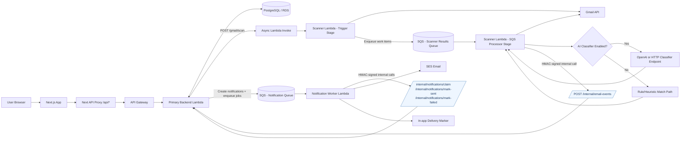
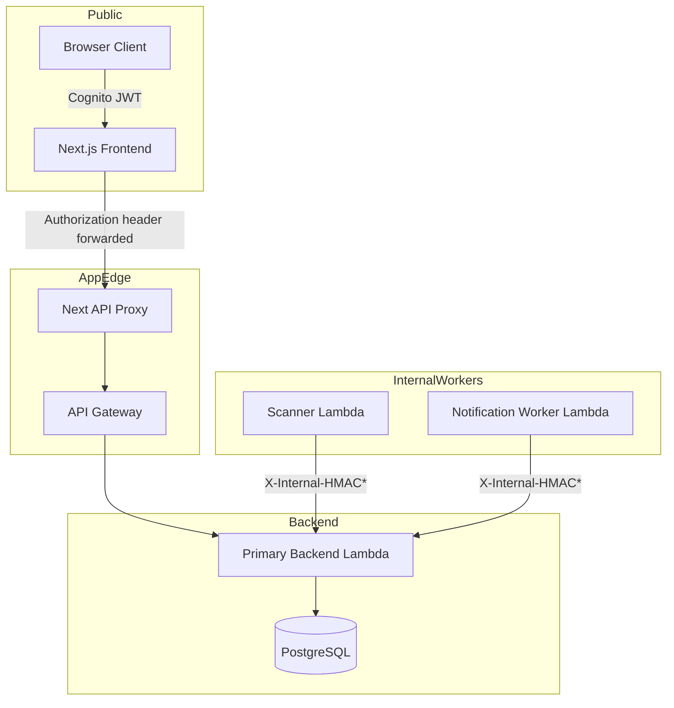

# Interview King Architecture Diagram

This diagram reflects the implemented runtime flow in the current repository.

## System Flow (Current)

## Trust + Auth Boundaries

## Quick Notes

- Scanner pipeline is two-stage: trigger stage and SQS processor stage.
- Notification queue is consumed by Notification Worker, not by Primary Backend as the delivery engine.
- Primary Backend remains source of truth for notification state.
- AI classification is optional and controlled by environment flags.
